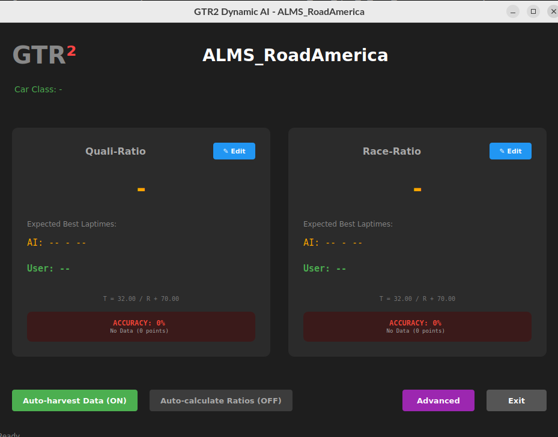
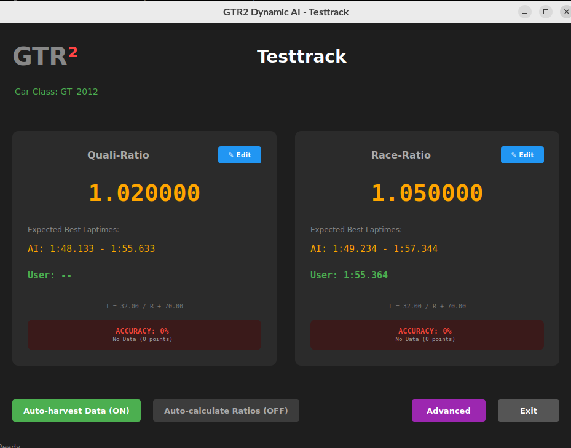
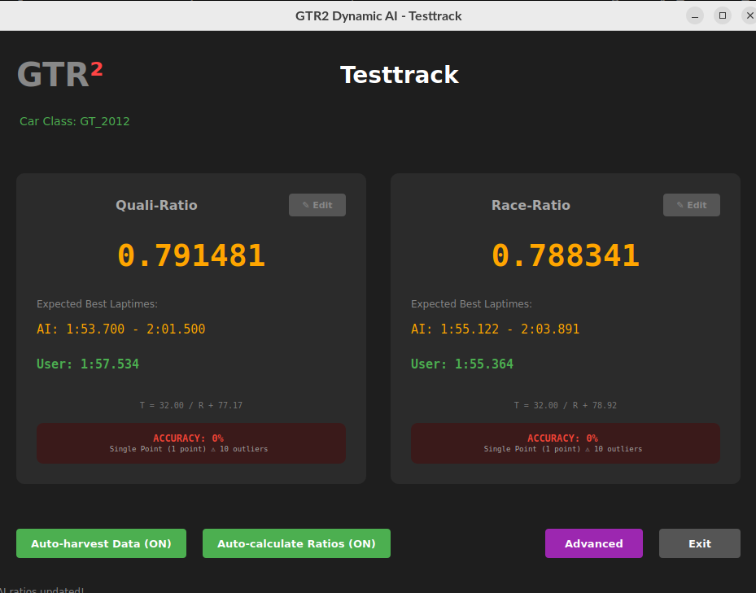
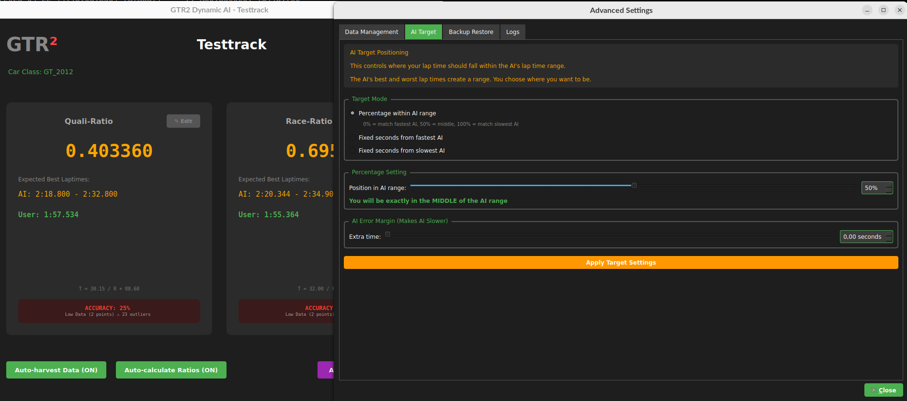
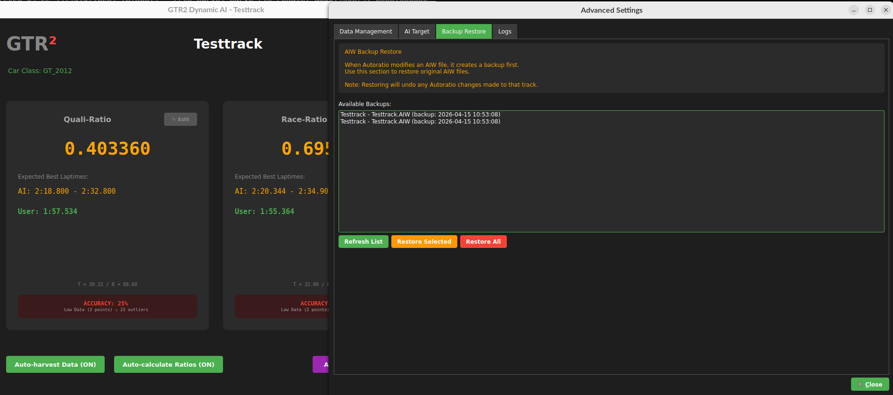
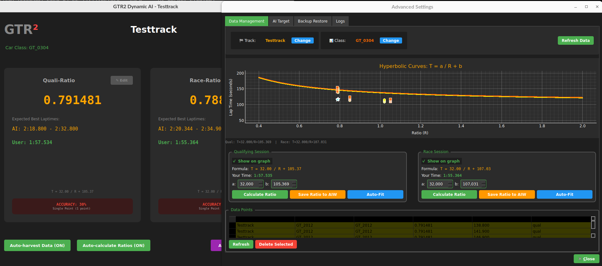

# dyn_ai — Live AI Tuner for GTR2 - v1.0.4

## What it does

It automatically adjusts AI difficulty(*) to match your driving pace. When you complete a lap, it reads your time, calculates the optimal AI speed ratio, and updates the track's AIW file - making AI opponents race at your level.

(*) This is not the same AI difficulty you can change on GTR2 itself, it is a variable on each Track, that is different for Race and Qualy Sessions.

---

## Current State

Usable, but it needs a bit of babysitting.

Still: USE IT AT YOUR OWN RISK, probably on a SEPARATED DROP and please, ping me with as many bugs as you can.

---

## Quick Start

- Check and try to adapt cfg.yml
- Same for vehicle_classes.json

**Windows (easy mode):**  
Open dyn_ai_vX.X.X.zip, grab the `.exe` from the zip, run it, done.

**From source:**
```bash
pipenv install
pipenv run python3 dyn_ai.py
```

First launch will ask you to point it at your GTR2 install folder (the one that has `GameData/` in it). It saves that to `cfg.yml` so you only do this once.

---

## Main Features




### Auto-harvest Data

Saves every race session to the database. Builds a history of lap times vs AI ratios.

### Auto-calculate Ratios



When enabled:

    Detects new race results

    Analyzes all historical data for the track/car combination

    Fits a hyperbolic curve (T = a/R + b) to minimize error

    Updates the AIW file with the new ratio

Result: AI that gradually learns your pace and adapts.

### AI Target Positioning



Controls where your lap time should fall within the AI range:
Mode	Effect
Percentage	0% = match fastest AI, 50% = middle, 100% = match slowest AI
Seconds from fastest	Fixed offset from best AI time (negative = faster than AI)
Seconds from slowest	Fixed offset from worst AI time

Access this via the Advanced button.

Last but not least...this has not yet been tested, be the first to do so and win a fantastic troubleshooting with me!

### Manual Controls

Even with auto-calculation off, you can:

    Edit ratios directly - Click the ✎ button on Quali-Ratio or Race-Ratio panels

    Calculate from lap time - Enter your lap time, get the required ratio

    Save formulas manually - Create formulas from any data point


---

## Advanced Features

### Data Management (Advanced → Data Management)


    Track/Class selection - Filter data by track and vehicle class

    Curve graph - Visualizes data points and fitted curves

    Session panels - Separate controls for Qualifying and Race:

        Show/hide data on graph

        Edit a and b parameters manually

        Calculate ratio from your lap time

        Auto-fit curve to existing data

    Data points table - View, select, and delete individual data points

### AIW Backup Restore (Advanced → Backup Restore)



Every AIW modification creates a backup (*_ORIGINAL.AIW). Use this to:

    Restore individual track AIW files

    Restore all backed-up files at once

### Log Viewer (Advanced → Logs)



Displays program activity. Filter by level (ERROR/WARNING/INFO/DEBUG/ALL).

---

## Understanding the Formula

T = a / R + b
Variable	Meaning
T	Lap time (seconds)
R	AI speed ratio (QualRatio or RaceRatio)
a	Curve slope - controls sensitivity
b	Curve height - base lap time

    Higher R = faster AI

    Lower R = slower AI

    Formula fits historical data to predict required R for your lap time


---

## Files
File	                Purpose
cfg.yml	                Configuration (GTR2 path, database, etc.)
ai_data.db	            SQLite database storing all data points and formulas
vehicle_classes.json	Maps vehicle names to classes (Formula/GT/Prototype)
aiw_backups/	        Original AIW backups (created automatically)

---

## Tips

    Let data accumulate - The more laps you complete, the better the curve fit

    Different car classes - Formulas are stored per track AND car class

    Error margin - Adding 0.5-1.0 seconds makes AI slightly slower (good for learning tracks)

    Backups are automatic - Never lose original AIW files

    Qualifying vs Race - Separate ratios for each session type

---

## Troubleshooting

"No base path configured" → Set base_path in cfg.yml

AI ratios not updating → Ensure Auto-calculate Ratios is ON (green)

Database errors → Run cleanup_formulas_table.py to fix schema

Can't find AIW file → Verify GTR2 path and that the track folder exists in GameData/Locations

My data does not show classes but individual cars → Create a new class with all the cars you want on vehicle_classes.json. On Advanced>Data you can also select the related entries and delete them.

---

## Wishlist

- Ability to target specific positions (e.g., "make me top-5" instead of midpoint)
  - There is a rough implementation on advanced
- Export/import formulas for sharing between users

---

## TODO NEXT

- Solve errors:
  - ask for base path when not defined
  - test full process from no data to more and more
- Simplify code A LOT
- Move on to a better, dynamic, way of doing this on the fly.

